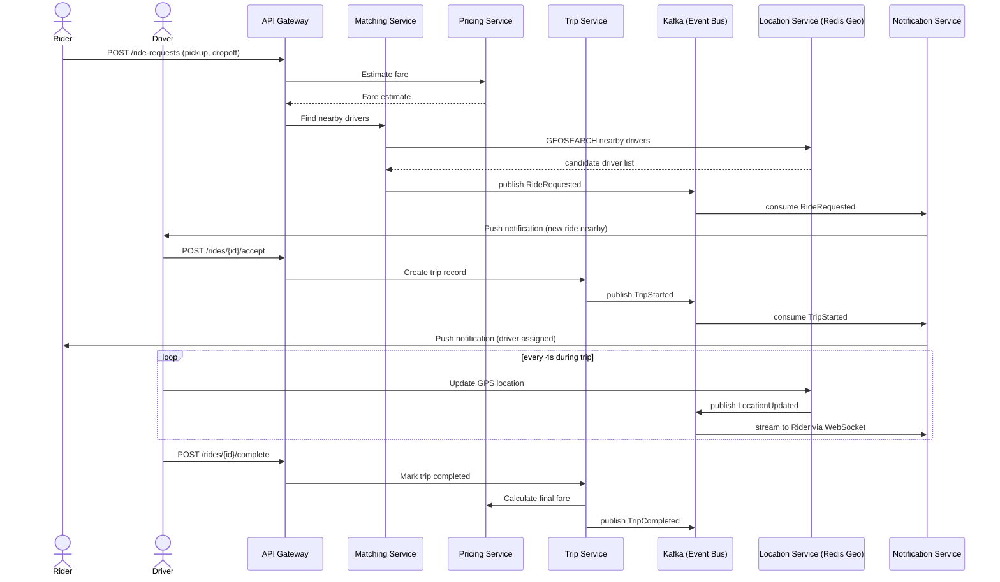
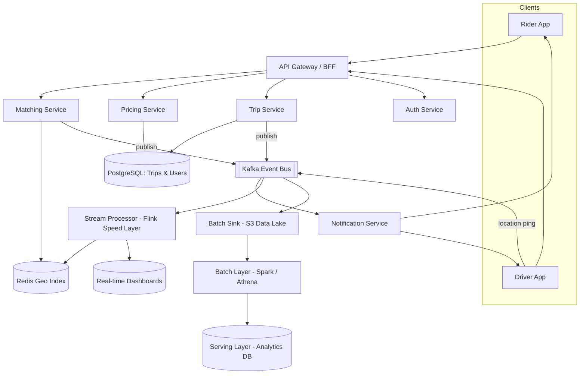
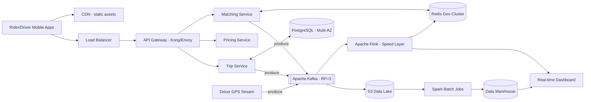

# Grab Mini — Ride-Hailing System Design

> A condensed system design showcase for a Grab/Uber-style ride-hailing
> matching platform. Scope is intentionally narrow — **rider request →
> driver match → live trip tracking → fare settlement** — but the design
> decisions, trade-offs, and failure handling reflect what a production
> large-scale system actually needs.

Live diagrams: open [`index.html`](./index.html) in a browser, or read the
Mermaid diagrams below (renders natively on GitHub).

---

## 1. Requirements

**Functional**
- Rider requests a ride with pickup/dropoff coordinates and gets a fare estimate.
- System matches the rider with the nearest available driver in real time.
- Driver streams GPS location during the trip; rider sees live tracking.
- Trip lifecycle (requested → accepted → in-progress → completed) is persisted.
- Final fare is calculated and settled on trip completion.

**Non-functional**
- **Low-latency matching**: nearest-driver lookup must return in single-digit milliseconds.
- **High availability**: matching and trip services must tolerate single-node/broker failures.
- **Eventual consistency** is acceptable for driver location data (a few seconds of staleness is fine).
- **Strong consistency / durability** is required for trip and payment records.

---

## 2. Sequence Diagram — Ride Request to Trip Completion

**In plain English:** You tap "Book ride" → the app instantly quotes a price
and shouts "who's nearby?" → the closest driver gets a notification and taps
"Accept" → you both get notified "you're matched". While the trip is
running, the driver's phone pings its location every 4 seconds so your map
updates live. When the driver taps "Complete", the app calculates the final
price and closes the trip. Every step is just a message being passed to the
next person/system, like a relay race.

---

## 3. Functional / Component Architecture

**In plain English:** This is the "org chart" of the system — who talks to
whom. Both apps walk through one front door (**API Gateway**). Behind that
door sit specialist teams that each do ONE job — Matching finds drivers,
Pricing does fares, Trip keeps records. Instead of these teams calling each
other directly for every little update, they all pin notes to one shared
notice board (**Kafka**). Anyone interested — notifications, live dashboards,
or the end-of-day reporting team — just reads the notice board at their own
pace. Nothing is tightly wired together, so one slow/broken team doesn't jam
up everyone else.

---

## 4. Final Architecture (Concrete Stack)

**In plain English:** Same picture as above, just with real product names
slapped on. **Kong/Envoy** is the front door bouncer. **Kafka** is the notice
board — but now with 3 copies of every note pinned in 3 different rooms so
nothing gets lost if one room floods. **Redis** is a super-fast phonebook
answering "which drivers are near here *right now*?". **PostgreSQL** is the
permanent filing cabinet for trips and payments — the stuff that must never
disappear. **Flink** reacts to notice-board updates *immediately* (for live
maps/dashboards), while **Spark** quietly processes yesterday's notes
overnight for management reports. Same data, two speeds, two jobs.

---

## 5. Deep Dive Architecture

### 5.1 Trade-off Analysis

> Every "we chose X" decision below is really "we chose X over Y, and here's
> the bet we're making." No option is free — each one trades something away.

#### Decision 1 — Streaming engine for driver GPS pings: **Flink** vs Spark Structured Streaming

| | Apache Flink (chosen) | Spark Structured Streaming |
|---|---|---|
| Processes each event | The instant it arrives | In small batches (e.g. every few seconds) |
| Latency | Milliseconds | Hundreds of ms to seconds |
| Trade-off | More complex to operate (constant "state" to manage) | Simpler ops, but adds visible delay |

💡 **Imagine this:** 100 drivers each shout "I'm here!" every 4 seconds.
Flink is like a person standing there who reacts to *each shout the moment
it happens* — your live map updates instantly. Spark Streaming is like
someone who checks their mailbox every few seconds, scoops up everything
that arrived, and processes it as one bundle — like checking voicemail
instead of picking up the phone. For a live "where's my driver" map, that
gap is the difference between "accurate" and "my driver looks like they're
on the wrong street."

#### Decision 2 — Nearest-driver lookup: **Redis Geo** vs PostGIS (Postgres spatial queries)

| | Redis Geo (chosen) | PostGIS on PostgreSQL |
|---|---|---|
| Where data lives | In memory (RAM) | On disk, in the main database |
| Lookup speed | Sub-millisecond | Milliseconds to tens of ms |
| Trade-off | Data isn't permanently durable — but that's fine, it's refreshed every few seconds anyway | Durable & transactional — but slower under heavy concurrent reads |

💡 **Imagine this:** You're on a street corner and shout "who's within 2km of
me?" Redis Geo is like asking a friend who's standing right there with the
whole city map memorised in their head — instant answer. PostGIS is like
asking someone to walk to a filing room, pull out paper records, and
calculate distances by hand — still correct, just slower. Since thousands of
riders ask "who's near me?" every second, and a driver's position is
outdated within 4 seconds anyway, we want the instant-answer friend, not the
filing room.

#### Decision 3 — Internal service calls: **gRPC** vs REST/JSON

| | gRPC (chosen, internal only) | REST/JSON (kept for public API) |
|---|---|---|
| Message format | Compact binary | Readable text (JSON) |
| Speed | Faster, less network overhead | Slower, more "padding" per message |
| Trade-off | Both sides must share a strict pre-agreed format | More flexible/universal, easier for outside developers |

💡 **Imagine this:** REST/JSON is like writing a full formal email — subject
line, greeting, signature — every time you ask a colleague "what's the fare
for trip #4521?". gRPC is like using a walkie-talkie with pre-agreed short
codes: "Fare? #4521." → "12.50." Way faster, but both people need the same
codebook. Our internal services all share that codebook (gRPC). The public
API still speaks normal "email" (REST) because outside apps and developers
expect that.

#### Decision 4 — Trip/payment events: **Kafka (`acks=all`, idempotent)** vs direct synchronous DB writes

| | Kafka event bus (chosen) | Direct synchronous writes |
|---|---|---|
| How it works | Trip Service posts one event; others read it whenever | Trip Service calls each downstream system directly and waits |
| If a downstream system is slow/down | No impact — message waits on the bus | Trip Service itself gets stuck/blocked |
| Trade-off | Consumers might see a message twice — must handle duplicates | Simpler mentally, but one slow dependency can stall the whole trip flow |

💡 **Imagine this:** Trip Service finishes a ride and needs to tell Billing,
Notifications, and Analytics. *Direct writes* = walking to each department's
office and waiting for them to say "got it" before moving to the next — if
Billing is at lunch, you're stuck standing in their doorway. *Kafka* = pinning
one notice to a shared board (with 3 copies pinned in different rooms so it
can't be lost) and walking away — each department reads it when they're
free. `acks=all` just means: don't walk away until you've confirmed all 3
copies are safely pinned.

---

### 5.2 Failure Modes & Mitigation

> For each failure: **what it is**, **when it actually happens**, **what
> breaks if we do nothing**, and **why the fix works** — with a dumb
> real-world analogy.

#### 🔴 Kafka broker failure

- **What it is:** Kafka runs as a cluster of several servers ("brokers")
  that store all the event messages. A "broker failure" = one of those
  servers crashes — hardware dies, a data-center rack loses power, the OS
  hangs. This happens **regularly** at scale; cloud servers fail all the
  time.
- **What breaks if unaddressed:** if that broker held the *only* copy of a
  message like "TripCompleted → charge rider $15", that message — and the
  record of that charge — simply vanishes.
- **The fix:** `replication factor = 3` means every message is automatically
  copied to 3 different brokers. `min.insync.replicas = 2` + `acks=all`
  means the Trip Service won't consider a message "saved" until at least 2
  of those 3 copies confirm they have it.
- 💡 **Imagine this:** You sign an important contract. Instead of keeping 1
  copy in your desk drawer, you photocopy it and mail copies to 2 friends in
  different cities — and you don't consider the deal "done" until both
  friends text back "got it". If your office burns down, the deal still
  exists. That's `replication factor = 3` + `min.insync.replicas = 2`: even
  if one Kafka server room catches fire, two safe copies of every
  trip-completed (and payment) message still exist elsewhere.

#### 🔴 Matching service overload (e.g. surge during a rainstorm)

- **What it is:** The Matching Service finds nearby drivers for every ride
  request. "Overload" = far more requests arrive per second than it can
  process — e.g. it suddenly starts raining and half the city opens the app
  at once.
- **What breaks if unaddressed:** requests pile into a queue, response times
  balloon from 200ms to 30+ seconds, and eventually the service runs out of
  memory/threads and **crashes** — taking down ride-booking for *everyone*,
  including the people whose requests were perfectly easy to handle.
- **The fix:** a bounded queue + circuit breaker — cap how many requests can
  wait in line; once full, immediately reply "sorry, very busy, try again
  shortly" instead of accepting more and crashing later.
- 💡 **Imagine this:** A restaurant during dinner rush. If the host keeps
  seating walk-ins no matter what, the kitchen eventually melts down and
  *everyone's* food — including orders already cooking — gets ruined. A
  smart host instead tells new walk-ins past a point "sorry, 45-minute wait"
  — annoying for them, but everyone already seated still gets fed.

#### 🔴 Late or out-of-order location events

- **What it is:** A driver's phone sends a GPS ping every 4 seconds. Mobile
  networks (tunnels, dead zones, congestion) sometimes delay these pings or
  deliver them out of order.
- **What breaks if unaddressed:** the system might process a "10 seconds
  ago" location *after* a "5 seconds ago" location, making the live map
  think the driver teleported backwards, or corrupting distance/ETA
  calculations.
- **The fix:** Flink uses a **watermark with ~30s allowed lateness** — a
  deliberate small grace period where the system waits for stragglers before
  finalizing a calculation, then puts everything back in the correct order.
- 💡 **Imagine this:** You're grading a stack of exam papers and one
  student's paper slides under the door 20 seconds after you started. You
  don't bin it — you leave a small gap in the pile for late arrivals (up to
  ~30 seconds), then grade everything in the right order. After that window,
  too late, sorry.

#### 🔴 Duplicate event processing (`TripCompleted` delivered twice)

- **What it is:** Kafka guarantees "at-least-once" delivery — if a consumer
  crashes right after processing a message but *before* confirming it,
  Kafka will resend it. So the same event can legitimately arrive twice.
- **What breaks if unaddressed:** if "TripCompleted → charge rider $15" is
  processed twice, the rider gets charged **$30**.
- **The fix:** idempotency — each event carries a unique ID (`trip_id` +
  `event_type`), and the database has a rule: "I will only ever save ONE row
  with this exact ID; reject duplicates."
- 💡 **Imagine this:** A bouncer checking wristbands at a club entrance. If
  the same wristband number tries to enter twice, the second attempt is
  turned away — even if the person insists they "just got here." The
  database does the same: "I already processed trip #4521's completion,
  ignoring this duplicate."

#### 🔴 Redis Geo cluster node failure

- **What it is:** The "who's near where" map lives in memory across several
  Redis servers for speed. A "node failure" = one of those servers crashes.
- **What breaks if unaddressed:** if the server holding driver-location data
  dies and there's no backup, Matching can't find *any* nearby drivers —
  total outage for new ride requests.
- **The fix:** cluster mode with replicas — at least 2 copies of the
  location data live on different servers; if one dies, a replica is
  instantly promoted to take over. Riders might see driver positions a few
  seconds staler during the switch — acceptable, since this data is already
  only "accurate as of a few seconds ago."
- 💡 **Imagine this:** Two whiteboards in two different rooms, both showing
  the same live "available drivers nearby" list, kept in sync. If someone
  knocks over one whiteboard, staff just walk to the other room and keep
  working off the second one — a few seconds of confusion, but the business
  doesn't stop.

---

### 5.3 Capacity Estimation

> **Why bother doing this math at all?** Before building anything, we
> estimate how much "traffic" the system needs to handle — like figuring out
> how many checkout counters a supermarket needs *before* opening, based on
> expected foot traffic. Get it wrong in one direction and you're paying for
> empty servers every month; get it wrong the other way and the app crashes
> exactly when it's most popular (rush hour, a marketing campaign, a viral
> TikTok). This exercise is literally how engineering teams justify their
> cloud budget to finance — "here's the math behind why we need this much,
> not more, not less."

Assumptions: **1M daily active riders**, **100K active drivers at peak**,
**~30% of peak drivers on an active trip** sending a GPS ping every 4
seconds, **2M ride requests/day**.

| Metric | Calculation | Result | What this means in practice |
|---|---|---|---|
| Location ping throughput | 30,000 drivers ÷ 4s | ~7,500 events/sec | ~7,500 "I'm here!" shouts arriving *every single second*, all day — that's the baseline load the system must never choke on. |
| Location stream bandwidth | 7,500/s × ~200 bytes/event | ~1.5 MB/s (~130 GB/day) | Roughly the size of 30 mp3 songs flowing through the system *per second* — easily handled by normal infrastructure. |
| Ride request load (avg / peak) | 2M/day ÷ 86,400s, ×5 for peak multiplier | ~25 req/s avg, ~125 req/s peak | The "rainstorm scenario": Matching must be sized for ~125 booking attempts/sec, not just the calm average of 25. |
| Kafka partitions (location topic) | 7,500 events/s ÷ ~1,000 events/s per partition, + headroom | **12 partitions** | Think of partitions as lanes on a highway. Each lane comfortably handles ~1,000 "cars" (events)/sec; we have ~7,500, so 12 lanes gives room to grow 2-3x before we need roadworks (repartitioning). |
| Kafka retention before S3 offload | 130 GB/day × 7 days | ~910 GB hot retention | About 1 week of "recent mail" kept in fast storage in case anything needs to be reprocessed — like keeping last week's receipts in your desk drawer before filing them away. |
| S3 cold storage (compressed, Parquet ~10x) | 130 GB/day ÷ 10 | ~13 GB/day | Compressing the daily pile of location pings before long-term archiving — same information, ~10x less storage cost, like zipping a folder of receipts before filing. |
| Redis Geo cluster sizing | 100K drivers × ~100 bytes | <50 MB data — sized for **read QPS**, not capacity (3-node cluster for HA) | The *entire* live "who's near where" map for 100,000 drivers fits in less than 50MB — smaller than a few phone photos. We don't need big servers for *storage* here; we need *fast* servers, because thousands of people ask "who's near me?" every second. |

**What if we got these numbers wrong?**
- **Over-provisioned** (e.g. 50 Kafka partitions, huge Redis cluster): the
  system would still work, but the company pays for idle capacity every
  month — like renting a 10-lane highway for a quiet country road.
- **Under-provisioned** (e.g. 3 partitions, single Redis node): everything
  works fine on a normal day, then **falls over during the exact moments
  that matter most** — a surge, a promotion, a viral event — because there's
  no headroom and no backup.

These numbers also drive the failure-mode decisions in 5.2: a 3-node Redis
cluster isn't "because Redis needs lots of RAM" (it doesn't — see the table
above), it's because we need both speed *and* a backup node ready to take
over instantly.

---

## 6. Tech Stack Summary

| Layer | Technology |
|---|---|
| Edge / Static | CDN |
| API Gateway | Kong / Envoy |
| Services | Go/Java microservices (Matching, Pricing, Trip, Auth) — gRPC internally, REST externally |
| Geo / Hot cache | Redis (Geo commands, Cluster mode) |
| Transactional store | PostgreSQL (Multi-AZ) |
| Event bus | Apache Kafka (RF=3) |
| Speed layer | Apache Flink |
| Batch layer | Spark / Athena over S3 Data Lake |
| Serving layer | Analytics Data Warehouse → Real-time Dashboards |

---

## 7. Glossary — Plain-English Dictionary

> Read top to bottom and the whole system should click into place: clients
> talk through a **gateway** to small **services**, which post updates to an
> **event bus**, which feeds both a **fast lane** and a **slow lane** of data
> processing.

| Term | Plain-English meaning |
|---|---|
| **API** | A menu of requests one piece of software can make to another — e.g. "give me the fare estimate for this trip." |
| **API Gateway** | The single "front door" all apps go through. Checks who you are, then routes your request to the right team inside. |
| **Microservices** | Instead of one giant program doing everything, the system is split into small specialist teams (Matching, Pricing, Trip…) that each do one job and can be fixed/scaled independently. |
| **Load Balancer** | A traffic cop that spreads incoming requests across multiple identical servers, so no single server gets overwhelmed. |
| **CDN (Content Delivery Network)** | A network of servers around the world that store copies of static files (images, app assets) close to users, so things load fast no matter where you are. |
| **Kafka / Event Bus / Message Broker** | A shared "notice board" where services post updates ("RideRequested", "TripCompleted") and other services read them whenever they're ready — instead of calling each other directly. |
| **Topic / Partition** | A "topic" is one notice board (e.g. "location updates"). "Partitions" are multiple lanes within that board so many messages can be handled in parallel — like splitting one long queue into 12 shorter ones. |
| **Producer / Consumer** | A "producer" posts messages to Kafka (e.g. Trip Service). A "consumer" reads them (e.g. Notification Service). |
| **Replication Factor** | How many copies of each message Kafka keeps on different servers. "RF=3" = 3 copies, so losing 1-2 servers loses zero data. |
| **Idempotency** | Doing something twice has the *same effect* as doing it once — e.g. "charge $15 for trip #4521" only ever actually charges once, no matter how many times that instruction arrives. |
| **Redis** | An in-memory database — stores data in RAM instead of on disk, making it extremely fast but used for data that's okay to be temporary/refreshed often (like live driver locations). |
| **Geo-index / GEOSEARCH** | A way of storing locations so "find everything within X km of this point" is near-instant, instead of checking every record one by one. |
| **PostgreSQL / Database** | The permanent "filing cabinet" — stores trips, users, and payments durably. Designed so records never get lost or corrupted. |
| **ACID** | A guarantee that database transactions are all-or-nothing, consistent, and durable — e.g. a payment either fully completes or fully doesn't; it can't "half happen." |
| **Eventual Consistency** | "It'll be correct... eventually." Acceptable for things like driver location (a few seconds of staleness is fine), not acceptable for payments. |
| **gRPC vs REST** | Two ways services talk to each other. REST = normal web requests (flexible, used for public APIs). gRPC = a faster, compact "shorthand" format used between internal services that already agree on the format. |
| **Stream Processing (Flink)** | Processing each piece of data *the instant it arrives*, rather than waiting and processing things in batches. Used for anything that needs to feel "live." |
| **Speed Layer vs Batch Layer (Lambda Architecture)** | Two parallel pipelines: the **speed layer** (Flink) handles things in real time for live dashboards/maps; the **batch layer** (Spark) reprocesses everything overnight for accurate, complete reports. Same data, two different deadlines. |
| **Watermark / Allowed Lateness** | A deliberate grace period (e.g. 30 seconds) where a stream-processing system waits for late-arriving data before "closing the books" on a calculation. |
| **Circuit Breaker** | A safety switch that stops sending requests to an overloaded/broken service for a while, instead of piling on and making things worse — like a fuse box tripping to prevent a fire. |
| **Backpressure** | When a system that's receiving data faster than it can process pushes back ("slow down" or "stop") instead of silently falling further and further behind. |
| **Throughput / QPS (Queries Per Second)** | How many requests/events the system handles per second — the core unit for "how big do we need to build this?" |
| **Latency** | How long something takes to respond. Low latency = feels instant; high latency = feels laggy. |
| **SPOF (Single Point of Failure)** | Any one component that, if it breaks, takes the *whole system* down with it. Good architecture finds and eliminates these (e.g. via replication). |
| **Multi-AZ (Availability Zone)** | Running copies of a database/service in physically separate data centers, so a problem in one location (power outage, fire) doesn't take everything offline. |
| **S3 / Data Lake** | Cheap, near-infinite cloud storage used to archive large volumes of raw data long-term, for later analysis. |

---

*Built with [Claude](https://claude.ai) as part of an architectural-thinking
portfolio exercise — diagrams are Mermaid, rendered natively by GitHub and
in [`index.html`](./index.html).*
