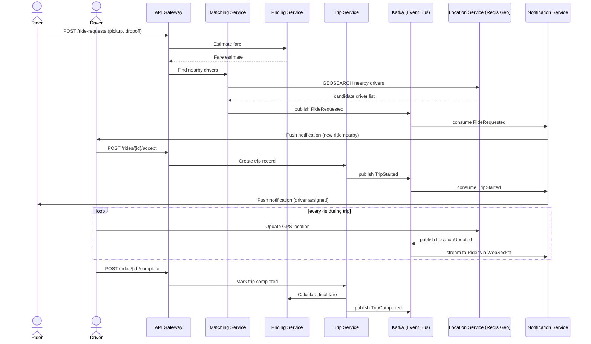
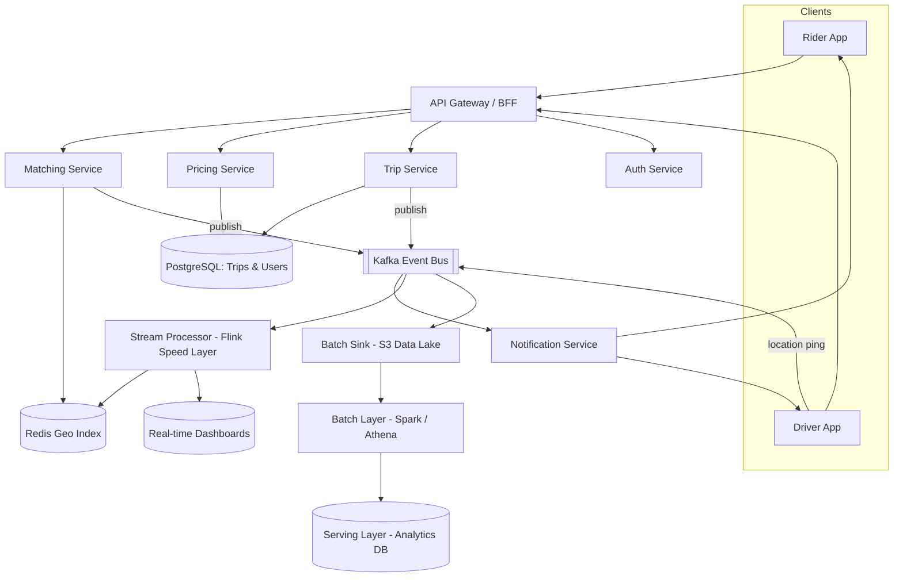
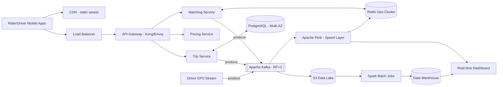

# Grab Mini — Ride-Hailing System Design

> A condensed system design showcase for a Grab/Uber-style ride-hailing
> matching platform. Scope is intentionally narrow — **rider request →
> driver match → live trip tracking → fare settlement** — but the design
> decisions, trade-offs, and failure handling reflect what a production
> large-scale system actually needs.

Live diagrams: open [`index.html`](./index.html) in a browser, or read the
Mermaid diagrams below (renders natively on GitHub).

---

## 1. Requirements

**Functional**
- Rider requests a ride with pickup/dropoff coordinates and gets a fare estimate.
- System matches the rider with the nearest available driver in real time.
- Driver streams GPS location during the trip; rider sees live tracking.
- Trip lifecycle (requested → accepted → in-progress → completed) is persisted.
- Final fare is calculated and settled on trip completion.

**Non-functional**
- **Low-latency matching**: nearest-driver lookup must return in single-digit milliseconds.
- **High availability**: matching and trip services must tolerate single-node/broker failures.
- **Eventual consistency** is acceptable for driver location data (a few seconds of staleness is fine).
- **Strong consistency / durability** is required for trip and payment records.

---

## 2. Sequence Diagram — Ride Request to Trip Completion

---

## 3. Functional / Component Architecture

---

## 4. Final Architecture (Concrete Stack)

---

## 5. Deep Dive Architecture

### 5.1 Trade-off Analysis

| Decision | Option chosen | Alternative | Why |
|---|---|---|---|
| Streaming engine for driver location pings | **Apache Flink** (true streaming) | Spark Structured Streaming (micro-batch) | Live ETA and trip tracking need sub-second latency. Flink's per-event processing model avoids the inherent batch-interval delay of Spark, at the cost of more complex state/checkpoint management. |
| Nearest-driver lookup | **Redis Geo (GEOSEARCH)** | PostGIS spatial queries on Postgres | Matching is on the critical path and must return in single-digit ms under high QPS. In-memory geo-indexing wins; we accept that location data is ephemeral and doesn't need ACID durability — it's recomputed every ping. |
| Internal service-to-service calls (Matching ↔ Pricing ↔ Trip) | **gRPC** | REST/JSON | Binary protobuf payloads and HTTP/2 multiplexing reduce internal latency and enforce strict contracts via `.proto` schemas. Public-facing API Gateway still exposes REST for client compatibility. |
| Trip/payment event delivery | **Kafka with `acks=all`, idempotent producers** | Direct synchronous DB writes | Decouples services and survives downstream outages, at the cost of needing idempotency handling on consumers (events can be delivered more than once). |

### 5.2 Failure Modes & Mitigation

- **Kafka broker failure** — Topics configured with `replication factor = 3` and `min.insync.replicas = 2`. Producers for trip/payment events use `acks=all`, so a single broker loss causes zero data loss.
- **Matching service overload (e.g. surge during rain)** — Bounded request queue + circuit breaker in front of Pricing. Once saturated, the service sheds load gracefully by returning a "high demand, longer wait" response instead of timing out or crashing.
- **Late/out-of-order location events** — Mobile networks cause GPS pings to arrive late or out of order. Flink jobs use **watermarks with allowed lateness (~30s)** so live-tracking and distance calculations aren't corrupted by stragglers, without holding up the stream indefinitely.
- **Duplicate event processing (`TripCompleted` delivered twice)** — Kafka's at-least-once delivery means consumers must be **idempotent**. Each event carries a `(trip_id, event_type)` key, and the Postgres writer enforces a unique constraint to dedupe.
- **Redis Geo cluster node failure** — Cluster mode with replicas handles automatic failover. Matching briefly serves slightly stale (few-second-old) location data — acceptable given location data is already eventually consistent.

### 5.3 Capacity Estimation

Assumptions: **1M daily active riders**, **100K active drivers at peak**, **~30% of peak drivers on an active trip** sending a GPS ping every 4 seconds, **2M ride requests/day**.

| Metric | Calculation | Result |
|---|---|---|
| Location ping throughput | 30,000 drivers ÷ 4s | ~7,500 events/sec |
| Location stream bandwidth | 7,500/s × ~200 bytes/event | ~1.5 MB/s (~130 GB/day) |
| Ride request load (avg / peak) | 2M/day ÷ 86,400s, ×5 for peak multiplier | ~25 req/s avg, ~125 req/s peak |
| Kafka partitions (location topic) | 7,500 events/s ÷ ~1,000 events/s per partition, + headroom | **12 partitions** |
| Kafka retention before S3 offload | 130 GB/day × 7 days | ~910 GB hot retention |
| S3 cold storage (compressed, Parquet ~10x) | 130 GB/day ÷ 10 | ~13 GB/day |
| Redis Geo cluster sizing | 100K drivers × ~100 bytes | <50 MB data — sized for **read QPS**, not capacity (3-node cluster for HA) |

These numbers drive concrete decisions: 12 Kafka partitions for the location
topic gives headroom for 2-3x peak growth without repartitioning; the small
Redis dataset means the cluster is provisioned for matching read throughput
and failover, not memory capacity.

---

## 6. Tech Stack Summary

| Layer | Technology |
|---|---|
| Edge / Static | CDN |
| API Gateway | Kong / Envoy |
| Services | Go/Java microservices (Matching, Pricing, Trip, Auth) — gRPC internally, REST externally |
| Geo / Hot cache | Redis (Geo commands, Cluster mode) |
| Transactional store | PostgreSQL (Multi-AZ) |
| Event bus | Apache Kafka (RF=3) |
| Speed layer | Apache Flink |
| Batch layer | Spark / Athena over S3 Data Lake |
| Serving layer | Analytics Data Warehouse → Real-time Dashboards |

---

*Built with [Claude](https://claude.ai) as part of an architectural-thinking
portfolio exercise — diagrams are Mermaid, rendered natively by GitHub and
in [`index.html`](./index.html).*
